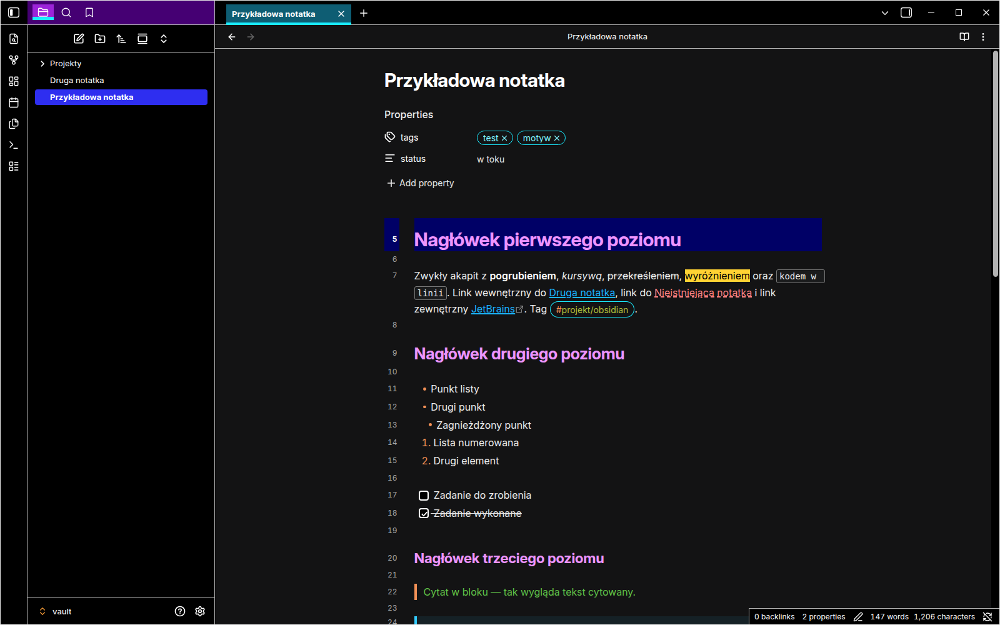
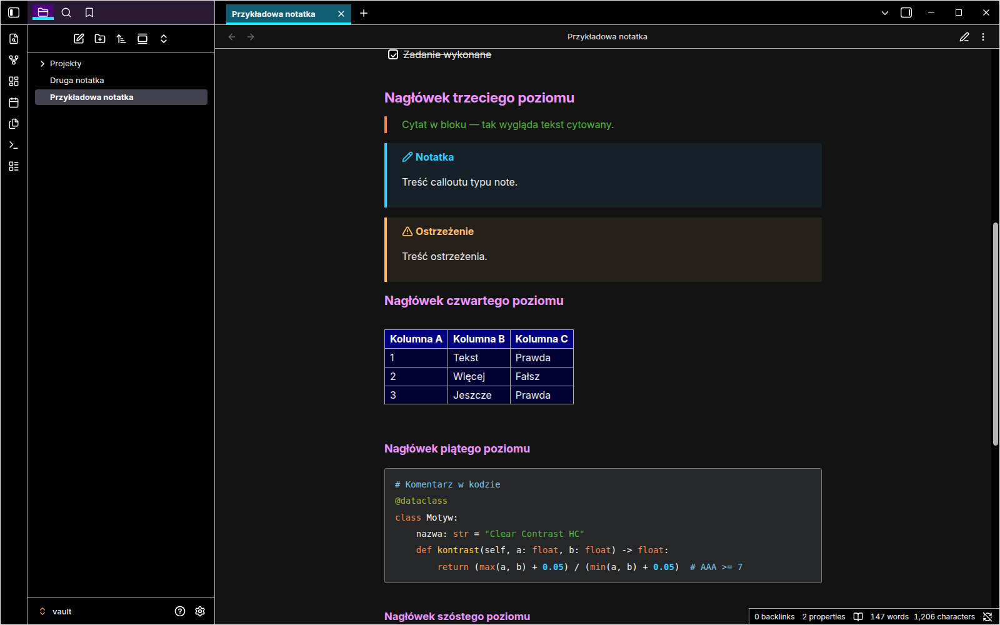
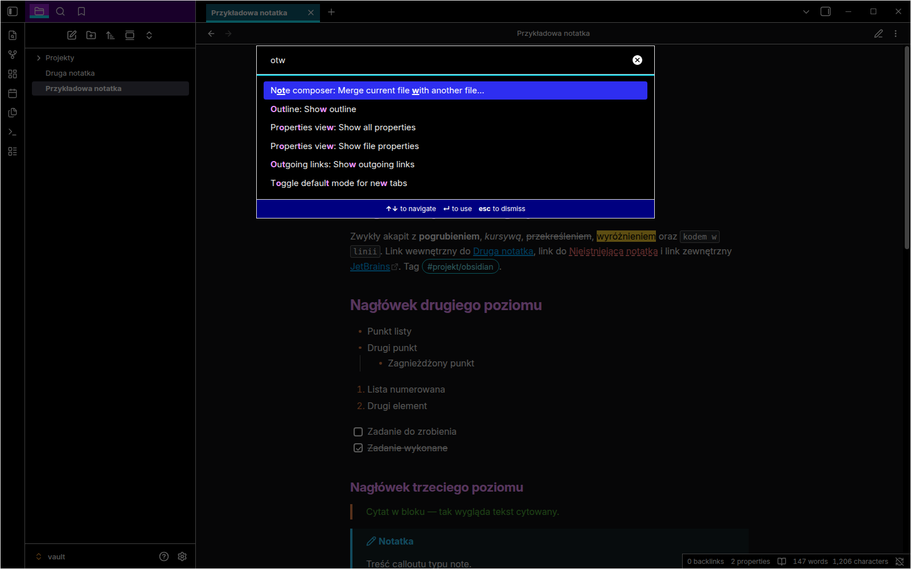
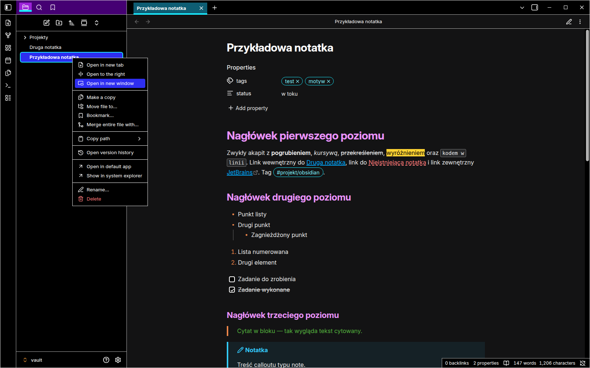
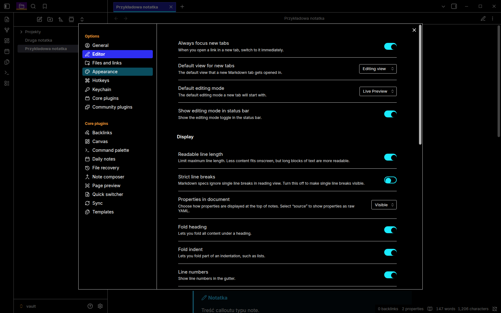

# Clear Contrast HC

A high-contrast dark theme for [Obsidian](https://obsidian.md), modelled on **JetBrains High Contrast** (the IntelliJ IDEA / PyCharm / WebStorm theme) and built for people with low vision.

Every text color has a contrast ratio of at least **7:1**, the WCAG 2.2 AAA level. The theme works well with screen magnifiers and large zoom levels.

> 🇵🇱 [Polish description below.](#-po-polsku)
>
> 🤖 Created with the help of [Claude](https://claude.ai) by Anthropic – see [Credits](#credits-and-license).

---

## Why this theme?

Most dark themes use grey text on a grey background, thin icons and subtle hover effects. At 200–400% magnification those details disappear. JetBrains High Contrast solves this in the IDE, and this theme brings the same look to Obsidian:

- **Pure black UI** with white text and **light borders** instead of shadows.
- **Clear state indicators:**
  - the active tab has a teal background and a cyan underline,
  - the selected item is solid blue,
  - keyboard focus has a cyan outline.
- **No transparency, blur or shadows**, so every element has a clear edge.
- **Thick white caret** and a navy highlight on the current line, so you don't lose your place when zoomed in.
- **Links are always underlined** and never rely on color alone. Unresolved links use a dashed red underline.
- **Wide, always-visible scrollbars.**
- **Reduced motion:** animations are turned off when the system has "reduce motion" enabled.

## Screenshots

| Reading view | Command palette |
|---|---|
|  |  |

| Context menu | Settings – Islands variant |
|---|---|
|  |  |

## What is carried over from JetBrains High Contrast

Colors are taken directly from the open-source IntelliJ Platform files, not eyeballed from screenshots.

**Interface**

| Element | Look |
|---|---|
| Sidebars (tool windows) | Purple header (`#450073`), dimmed when the panel is not focused (`#281A33`); selected tab `#9C23D9` with a 5px cyan underline |
| Editor tabs | Active tab `#0E5D73` with a 4px cyan underline |
| Selection in lists and trees | Blue with white text; grey (`#42424F`) when the panel is not focused |
| Buttons | Black with a white border; primary button cyan with black text |
| Toggles | Off: black; on: navy (`#000080`); white border and knob |
| Checkboxes | Black with a white border and white check mark |
| Menus and popups | Black with a light border, white separators, blue hover |
| Command palette footer, notifications, table headers | Navy (`#000080`) |
| Tooltips | Purple (`#450073`) with a light border |
| Counters and badges | White with black text |
| Search matches | Black text on yellow (`#FFD333`) |
| Matched letters in quick switcher | Pink, bold |
| Disabled elements and placeholders | Orange text, as in JetBrains |
| Window | Thin light border around the whole window |

**Editor ("High contrast" color scheme)**

| Element | Look |
|---|---|
| Headings | Pink (constant color) |
| Markdown markers (`#`, `**`, `-`, `>`) | Orange (keyword color) |
| Blockquotes | Green text, orange bar |
| Links | Blue, underlined |
| Current line | Navy (`#000066`) |
| Matching brackets | Bold yellow with an outline |
| Find in note | Navy background with a blue outline |
| Code blocks | Keywords orange, strings green, numbers bold blue, comments light blue, functions yellow, annotations olive |
| Callouts | JetBrains Markdown alert colors (note, tip, important, warning, caution) |
| Tags | Cyan outline; on hover, black text on cyan |

## Changes from the original (for accessibility)

1. **Slightly brighter colors.** About ten JetBrains colors were just below the 7:1 ratio, for example green strings (`#54B33E`), orange keywords (`#ED864A`) and blue selection (`#3333FF`). They were adjusted by the smallest amount needed to reach AAA. Each original value is noted in a comment in `theme.css`.
2. **Thicker caret** than in the IDE (3px).
3. **Headings are not italic by default.** Italic is harder to read, but you can turn it on in the options.
4. **Font:** the theme prefers [Atkinson Hyperlegible](https://www.brailleinstitute.org/freefont/), a typeface designed for low vision, with [JetBrains Mono](https://www.jetbrains.com/lp/mono/) for code. If they are not installed, system fonts are used. You can change fonts in **Settings → Appearance**.

## Installation

### Manually

1. Download the latest release, or `theme.css` and `manifest.json` from this repository.
2. In Obsidian, open **Settings → Appearance** and click the folder icon next to **Themes**.
3. Create a folder named `Clear Contrast HC` and put both files in it.
4. Go back to Obsidian, click the refresh icon and choose **Clear Contrast HC**.

### From the community theme browser

*Coming soon* – once the theme is accepted into the Obsidian community catalogue, it will be available under **Settings → Appearance → Themes → Manage**.

## Options (Style Settings)

Install the [Style Settings](https://github.com/mgmeyers/obsidian-style-settings) plugin to access these options:

| Option | Description |
|---|---|
| **Islands variant** | The new JetBrains UI (2025+): black sidebar headers, black editor, blue (`#2121A6`) active tab, cyan toggles |
| **Colored heading levels** | Each heading level gets a different color instead of all pink |
| **Italic headings** | Matches JetBrains exactly |
| **Hide window border** | Removes the thin light frame around the window |

## Tips for low vision users

- Increase font size in **Settings → Appearance → Font size**, and zoom the whole interface with **Ctrl/Cmd +** and **Ctrl/Cmd −**.
- Turn on **Settings → Editor → Line numbers**. The current line number is highlighted in white on navy.
- Keep **Readable line length** on when using a magnifier, so you don't have to pan sideways.

## Compatibility

- Obsidian **1.5.0** or newer (tested on 1.12.7)
- Windows, macOS and Linux
- Dark theme only; the theme stays dark even if Obsidian is set to light mode

## Reporting problems

If something is hard to read, please [open an issue](../../issues). A short description of where it happens is enough, for example "Settings → Hotkeys, the key names are hard to read". A screenshot helps but is not required.

## Credits and license

- Colors are based on the **JetBrains High Contrast** theme and **High contrast** editor color scheme from [JetBrains/intellij-community](https://github.com/JetBrains/intellij-community), licensed under [Apache 2.0](https://www.apache.org/licenses/LICENSE-2.0). Source files:
  - `platform/platform-resources/src/themes/HighContrast.theme.json`
  - `platform/platform-resources/src/themes/islands/HighContrast.theme.json`
  - `platform/platform-resources/src/themes/highContrastScheme.xml`
- This project is **not affiliated with or endorsed by JetBrains**. JetBrains, IntelliJ IDEA and related names are trademarks of JetBrains s.r.o.
- Theme code: [MIT](LICENSE).
- Created with the help of [Claude](https://claude.ai), an AI assistant by [Anthropic](https://www.anthropic.com). Claude analysed the JetBrains theme files, wrote the CSS, checked the contrast ratios and tested the theme in Obsidian. Design decisions and accessibility feedback came from the author.

---

## 🇵🇱 Po polsku

**Clear Contrast HC** to ciemny motyw Obsidiana o wysokim kontraście, wzorowany na motywie **JetBrains High Contrast** i zaprojektowany z myślą o osobach słabowidzących. Każdy kolor tekstu ma kontrast co najmniej **7:1** (WCAG AAA). Motyw dobrze współpracuje z lupą systemową i dużym powiększeniem.

**Najważniejsze cechy:**
- czarny interfejs, biały tekst, jasne ramki zamiast cieni,
- fioletowe nagłówki paneli bocznych,
- aktywna karta z turkusowym podkreśleniem,
- niebieskie zaznaczenie,
- gruby biały kursor i granatowa aktywna linia,
- linki zawsze podkreślone,
- szerokie, zawsze widoczne paski przewijania,
- kolory składni ze schematu edytora JetBrains.

**Instalacja:**
1. W Obsidianie otwórz **Ustawienia → Wygląd → Motywy** i kliknij ikonę folderu.
2. Utwórz tam folder `Clear Contrast HC` i skopiuj do niego pliki `theme.css` oraz `manifest.json`.
3. Odśwież listę motywów i wybierz **Clear Contrast HC**.

**Opcje:** po zainstalowaniu wtyczki **Style Settings** możesz włączyć:
- wariant „Islands” (nowy interfejs JetBrains),
- kolorowe poziomy nagłówków,
- nagłówki kursywą,
- ukrycie ramki okna.

**Zgłaszanie problemów:** jeśli coś jest nieczytelne, [załóż zgłoszenie](../../issues). Wystarczy krótki opis miejsca, w którym występuje problem.

**Jak powstał:** motyw został stworzony przy pomocy [Claude](https://claude.ai), asystenta AI firmy [Anthropic](https://www.anthropic.com). Claude przeanalizował pliki motywu JetBrains, napisał kod CSS, sprawdził kontrast kolorów i przetestował motyw w Obsidianie. Decyzje projektowe i uwagi dotyczące dostępności pochodzą od autora.
